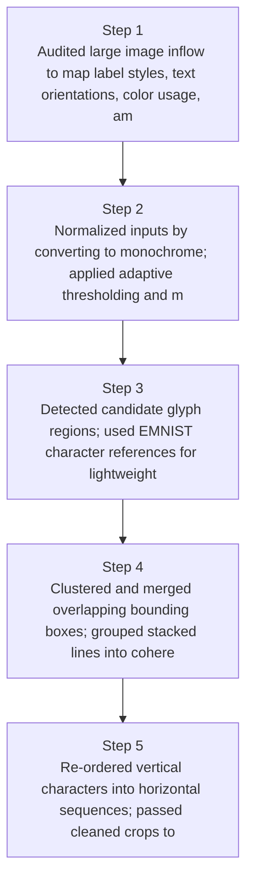
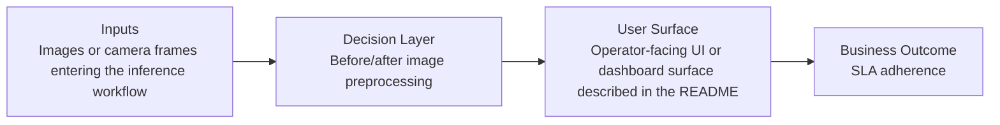
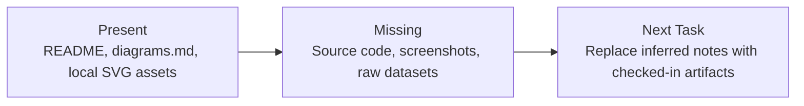

# Model-Free Vertical Text OCR Diagrams

Generated on 2026-04-26T04:29:37Z from README narrative plus project blueprint requirements.

## OCR pipeline step diagram

## Before/after image preprocessing

## Evidence Gap Map

